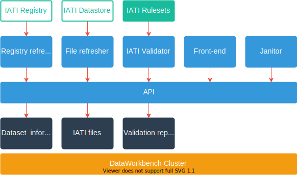

The DataWorkbench developer documentation provides technical information about our products.

## IATI Data Validation

The IATI Data Validation service consists of components to collect information from the IATI Registry, synchronise files with the IATI Datastore, validate the files with built-in IATI Rulesets, and make the validation reports available via an API and a web front-end application. A separate Janitor system does periodic clean-up.

The components use a central API service with back-end systems for dataset information and file storage for IATI files and validation reports.

The components run in Docker containers on a Kubernetes cluster.

In a schematic overview:

Components use different Github repositories and deployment configuration, with the combined documentation available via this site.

### Registry refresher

Updates the information about available publishers and datasets from the [IATI Registry](https://iatiregistry.org/).

* [Based on iati-kitchen](https://github.com/data4development/iati-kitchen) (Pentaho data processing)

### File refresher

Synchronises published IATI files from the IATI Datastore.

* [Based on the API stack](/dataworkbench-api/refresher.html) (Loopback/Express/Nodejs)
* Note: the Data4Development [DataWorkbench website](https://www.dataworkbench.io) uses a separate file refreshing process, independent of the Datastore.

### IATI Data Validator

Generates data quality feedback for IATI files, using both schema validation and business rules validation. The Validator itself is a worker engine that checks the system for unprocessed files. It can also be run on its own.

* [Based on the IATI Data Validator stack](/IATI-data-validator) (scripts and XSLT)
* The [IATI Rulesets](IATI-Rulesets) repository contains the business rules, and can be integrated in an XML pipeline on its own.
* The formats of the available validation reports are described as part of the documentation of the Validator. The reports are available as files, access to the files and metadata is described in the API documentation.

### Front end

Provides the web interface for data quality feedback, accessing public IATI data, and uploading files for validation.

* [Based on the Front end stack](/dataworkbench-frontend) (Angular)
* The API calls used by the front-end are described as part of the API documentation.

### API

Provides the point of entry to services on the cluster. The API can be started as *public* (exposed to the world) and in *private* (used by services and jobs within the cluster).

* [Based on the API stack](/dataworkbench-api/refresher.html) (Loopback/Express/Nodejs)

### Cluster

Provides the documentation and configuration of the infrastructure of the DataWorkbench.

* [Based on the Cluster repository](/dataworkbench-cluster) (Kubernetes)

## Supporting tools

- [DataWorkbench Jekyll Theme](/dataworkbench-jekyll-theme): theme for our GitHub pages, including styling for a few other tools

## Disclaimer

The documentation and the source repositories are a continuous work-in-progress,
and may not be complete or correct. We appreciate feedback, and
recommend to get in touch with questions and remarks.

We publish open source code and configuration for some of our products.

Some of our work is in private repositories. This can be exploratory
work to investigate approaches or to develop proof-of-concepts, tooling that
is extremely tailored to our own setup and needs, or any other reason.

* Contact us [via the Data4Development website](https://data4development.nl/en/contact-us/)
* Or submit an issue or pull request via an appropriate Github repository.
